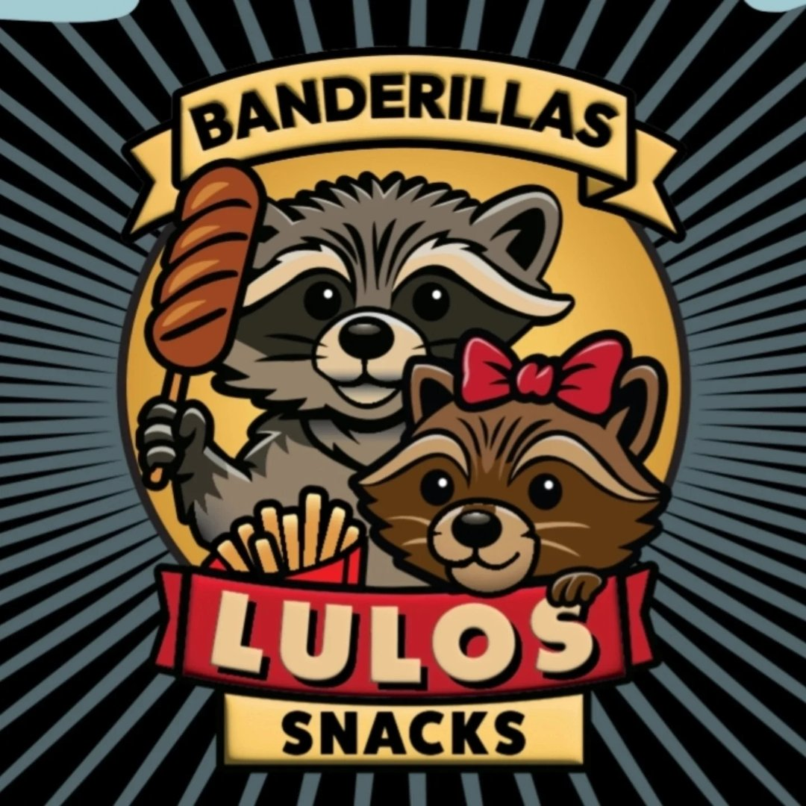

# 🚀 Guía de Despliegue y Optimización

## 📌 Índice
1. [Despliegue en Internet](#despliegue)
2. [Optimización SEO](#seo)
3. [Integración con Redes Sociales](#redes)
4. [Analytics](#analytics)
5. [Mejora de Rendimiento](#rendimiento)

---

## 🌐 Despliegue en Internet {#despliegue}

### Opción 1: Vercel (Recomendado - Gratis)
1. Ve a [vercel.com](https://vercel.com)
2. Haz clic en "Sign Up"
3. Conecta tu cuenta de GitHub o usa email
4. Haz clic en "New Project"
5. Sube tu carpeta (o conecta GitHub)
6. Vercel detectará automáticamente tu proyecto
7. Haz clic en "Deploy"
8. ¡Tu sitio está en línea! Tendrás una URL como: `tu-proyecto.vercel.app`

### Opción 2: Netlify (Gratis)
1. Ve a [netlify.com](https://netlify.com)
2. Haz clic en "Sign up"
3. Elige tu método de login
4. Arrastra y suelta tu carpeta en "Deploy site"
5. O conecta GitHub para deploy automático
6. Espera a que compile
7. Tu sitio estará en: `tu-proyecto.netlify.app`

### Opción 3: GitHub Pages (Gratis)
1. Crea un repositorio en GitHub
2. Sube tus archivos
3. Ve a Settings → Pages
4. Selecciona "main branch" como source
5. ¡Tu sitio estará en `tu-usuario.github.io`!

### Opción 4: Hosting Comercial
**Proveedores recomendados:**
- Bluehost (~$3/mes)
- SiteGround (~$3/mes)
- HostGator (~$3/mes)

**Pasos:**
1. Compra un dominio personalizado
2. Contrata hosting
3. Usa FileZilla o cPanel para subir archivos
4. Apunta el dominio al hosting

---

## 🔍 Optimización SEO {#seo}

### 1. Meta Tags Mejorados
Actualiza en `index.html`:
```html
<head>
    <meta charset="UTF-8">
    <meta name="viewport" content="width=device-width, initial-scale=1.0">
    <meta name="description" content="LULOS Banderillas - El mejor sabor hecho banderilla. Descubre nuestras banderillas artesanales y snacks deliciosos en [Tu Ciudad].">
    <meta name="keywords" content="banderillas, snacks, comida rápida, antojitos, [Tu Ciudad]">
    <meta name="author" content="LULOS Banderillas">
    <meta property="og:title" content="LULOS Banderillas - El mejor sabor hecho banderilla">
    <meta property="og:description" content="Descubre las mejores banderillas artesanales">
    <meta property="og:image" content="logo.jpg">
    <meta property="og:url" content="https://tu-sitio.com">
    <meta name="twitter:card" content="summary_large_image">
</head>
```

### 2. Google Search Console
1. Ve a [google.com/webmasters](https://google.com/webmasters)
2. Haz clic en "Comienza ahora"
3. Ingresa tu URL
4. Verifica tu sitio (opción más fácil: etiqueta HTML)
5. Envía tu sitemap

### 3. Sitemap XML
Crea `sitemap.xml`:
```xml
<?xml version="1.0" encoding="UTF-8"?>
<urlset xmlns="http://www.sitemaps.org/schemas/sitemap/0.9">
    <url>
        <loc>https://tu-sitio.com/</loc>
        <lastmod>2024-01-04</lastmod>
        <priority>1.0</priority>
    </url>
    <url>
        <loc>https://tu-sitio.com/#menu</loc>
        <priority>0.8</priority>
    </url>
    <url>
        <loc>https://tu-sitio.com/#nosotros</loc>
        <priority>0.7</priority>
    </url>
</urlset>
```

### 4. robots.txt
Crea `robots.txt`:
```
User-agent: *
Allow: /
Sitemap: https://tu-sitio.com/sitemap.xml
```

---

## 📱 Integración con Redes Sociales {#redes}

### 1. Facebook Pixel
Agrega en `index.html` antes de `</head>`:
```html
<!-- Facebook Pixel Code -->
<script>
  !function(f,b,e,v,n,t,s)
  {if(f.fbq)return;n=f.fbq=function(){n.callMethod?
  n.callMethod.apply(n,arguments):n.queue.push(arguments)};
  if(!f._fbq)f._fbq=n;n.push=n;n.loaded=!0;n.version='2.0';
  n.queue=[];t=b.createElement(e);t.async=!0;
  t.src=v;s=b.getElementsByTagName(e)[0];
  s.parentNode.insertBefore(t,s)}(window, document,'script',
  'https://connect.facebook.net/es_ES/fbevents.js');
  fbq('init', 'TU_PIXEL_ID');
  fbq('track', 'PageView');
</script>
<noscript></noscript>
<!-- End Facebook Pixel Code -->
```

### 2. Google Analytics
Agrega en `index.html` antes de `</head>`:
```html
<!-- Google Analytics -->
<script async src="https://www.googletagmanager.com/gtag/js?id=G-XXXXXXX"></script>
<script>
  window.dataLayer = window.dataLayer || [];
  function gtag(){dataLayer.push(arguments);}
  gtag('js', new Date());
  gtag('config', 'G-XXXXXXX');
</script>
```

### 3. Instagram Feed
Puedes integrar un feed automático de Instagram. Agrega antes de `</body>`:
```html
<!-- Instagram Feed (Elfsight) -->
<script src="https://apps.elfsight.com/p/platform.js" defer></script>
<div class="elfsight-app-12345"></div>
```

### 4. WhatsApp Flotante
Agrega antes de `</body>`:
```html
<script>
    var my_phone_number = "34XXXXXXXXX";
    var my_company_name = "LULOS Banderillas";
    
    function start_whatsapp() {
        var url_to_send = "https://web.whatsapp.com/send?phone=" + my_phone_number + "&text=" + 
                         encodeURIComponent("Hola " + my_company_name + ", quisiera información sobre tus banderillas");
        window.open(url_to_send);
    }
</script>
<button onclick="start_whatsapp()" style="
    position: fixed;
    bottom: 20px;
    right: 20px;
    background: #25D366;
    color: white;
    border: none;
    border-radius: 50%;
    width: 60px;
    height: 60px;
    font-size: 30px;
    cursor: pointer;
    z-index: 999;
    box-shadow: 0 5px 15px rgba(0,0,0,0.3);
">💬</button>
```

---

## 📊 Analytics {#analytics}

### Eventos a Rastrear
Actualiza `script.js` con:
```javascript
// Rastrear clicks en botones CTA
document.querySelectorAll('.btn-primary').forEach(btn => {
    btn.addEventListener('click', () => {
        if (typeof gtag !== 'undefined') {
            gtag('event', 'button_click', {
                'button_text': btn.textContent
            });
        }
    });
});

// Rastrear clics en enlaces de contacto
document.querySelectorAll('.contact-btn').forEach(btn => {
    btn.addEventListener('click', () => {
        if (typeof gtag !== 'undefined') {
            gtag('event', 'contact_click', {
                'contact_type': btn.textContent
            });
        }
    });
});

// Rastrear suscripción a newsletter
if (newsletterForm) {
    newsletterForm.addEventListener('submit', () => {
        if (typeof gtag !== 'undefined') {
            gtag('event', 'newsletter_signup');
        }
    });
}
```

---

## ⚡ Mejora de Rendimiento {#rendimiento}

### 1. Optimizar Imágenes
```bash
# Convertir logo a WebP
ffmpeg -i logo.jpg -c:v libwebp logo.webp
```

Actualiza el HTML:
```html
<picture>
    <source srcset="logo.webp" type="image/webp">
    
</picture>
```

### 2. Minificar CSS
Copia tu CSS a [cssminifier.com](https://cssminifier.com)

### 3. Minificar JS
Copia tu JS a [jscompress.com](https://jscompress.com)

### 4. Lazy Loading
```html

```

### 5. Cache Busting
Cambia las referencias a:
```html
<link rel="stylesheet" href="styles.css?v=1.0">
<script src="script.js?v=1.0"></script>
```

---

## 💰 Monetización

### 1. Google AdSense
1. Ve a [google.com/adsense](https://google.com/adsense)
2. Crea una cuenta
3. Verifica tu sitio
4. Agrega código publicitario

### 2. Afiliados
Puedes promover productos relacionados (accesorios para banderillas, ingredientes, etc.)

### 3. Email Marketing
Integra Mailchimp:
```html
<form action="https://tu-mailchimp-url" method="POST">
    <input type="email" name="EMAIL" placeholder="Tu email">
    <button type="submit">Suscribirse</button>
</form>
```

---

## 🔒 Seguridad

### 1. HTTPS
- Si usas Vercel/Netlify: ✅ Automático
- Si usas hosting: Solicita certificado SSL gratuito (Let's Encrypt)

### 2. Validar Formularios
```javascript
function validateEmail(email) {
    const re = /^[^\s@]+@[^\s@]+\.[^\s@]+$/;
    return re.test(email);
}
```

---

## 📋 Checklist Final

- [ ] Dominio personalizado
- [ ] Favicon agregado
- [ ] Meta tags correctos
- [ ] Google Search Console configurado
- [ ] Analytics instalado
- [ ] Facebook Pixel configurado
- [ ] Imágenes optimizadas
- [ ] CSS y JS minificados
- [ ] HTTPS activado
- [ ] Sitemap XML creado
- [ ] robots.txt creado
- [ ] Testeado en móvil y desktop
- [ ] Velocidad optimizada
- [ ] Formulario de contacto funcional
- [ ] Links internos correctos

---

## 🎯 Próximos Pasos

1. **Semana 1**: Despliega en Vercel/Netlify
2. **Semana 2**: Configura Google Analytics y Search Console
3. **Semana 3**: Integra Facebook Pixel y email marketing
4. **Semana 4**: Crea contenido en redes sociales
5. **Mes 2**: Realiza SEO técnico y analiza resultados

---

**¡Tu landing page está lista para conquistar el mundo de las banderillas! 🌮**
